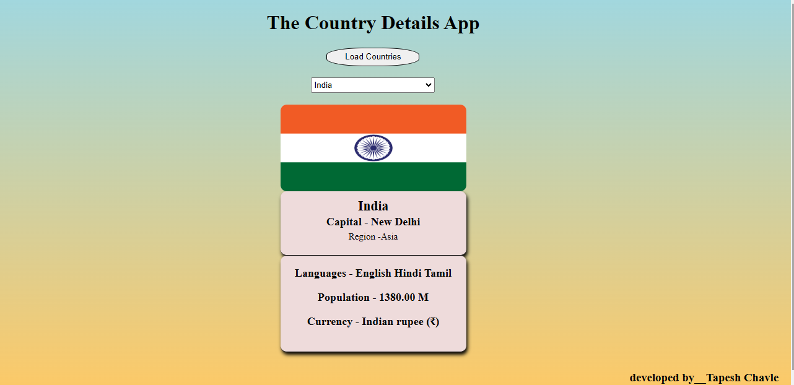

i# Country Information App

# Overview

The Country Information App is a web application that provides detailed information about all the countries of the world. The app fetches data from an external API and displays it in a user-friendly interface. The app is built using HTML, CSS, and JavaScript.

# Features

Fetch Country Data: Retrieve data for all countries using a RESTful API. 
Search Functionality: Search for a specific country by name. 
Country Details: Display detailed information about each country, including: 
Name 
Capital 
Population 
Region 
Flag 
Languages 
Currencies 

# User Interface

</img>

 <h3>Dropdown</h3>
 </img>

# Technologies Used

HTML: Structure the web page. 
CSS: Style the web page for a visually appealing design. 
JavaScript: Add interactivity and handle API requests. 
RESTful API: Source of country data (e.g., REST Countries API). 
here API used by me is https://restcountries.com/v3.1/all 

# Installation

To run the app locally, follow these steps: 

Clone the repository: 
bash 
Copy code 
git clone https://github.com/tapeshchavle/CountryAppDetails.git 
Navigate to the project directory: 

Open index.html in your browser: 
You can do this by double-clicking the index.html file or by serving it using a local server like Live Server in VSCode.

# Usage

Open the app: Launch index.html in your preferred web browser. 
Search for a country: Use the search bar to find a specific country by name. 
View country details: Click on a country from the search results to view detailed information. 

# Code Structure

 <h3>The project consists of the following files and directories:</h3>

index.html: The main HTML file that structures the app. 
styles.css: The CSS file that styles the app. 
script.js: The JavaScript file that handles API requests and DOM manipulation. 
README.md: This file, containing the project description. 

# Contributing

If you would like to contribute to this project, please fork the repository and submit a pull request with your changes. We welcome all contributions that improve the app.

# Acknowledgements

Data provided by the REST Countries API.
API https://restcountries.com/v3.1/all
